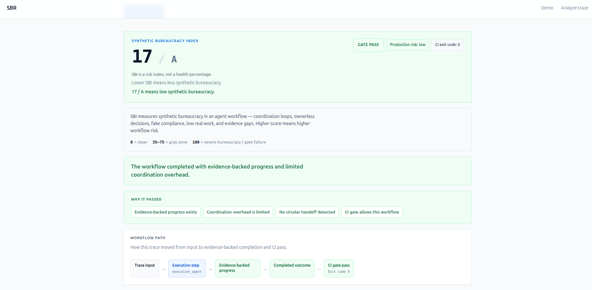
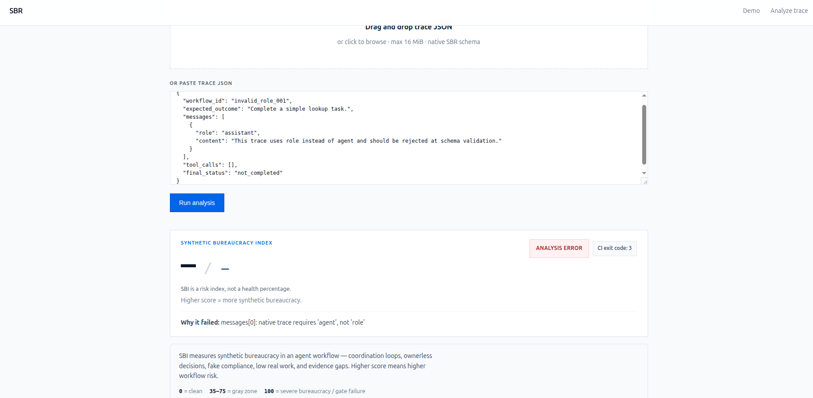
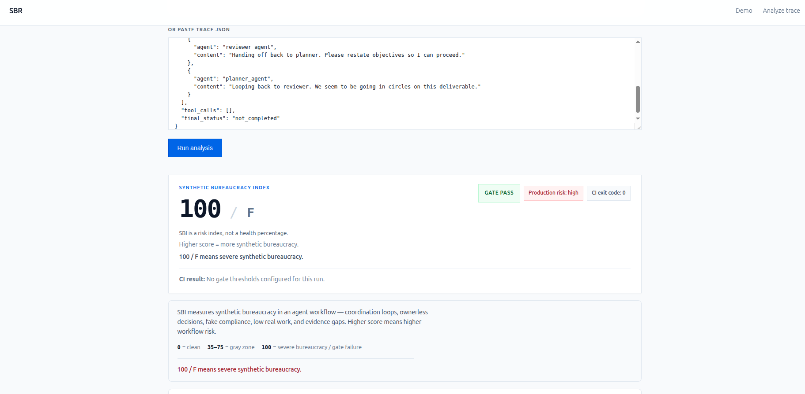

# SBR — Synthetic Bureaucracy Recompiler

**Deterministic analyzer for AI agent workflow traces.**

SBR scores **synthetic bureaucracy** in multi-agent workflows: coordination loops, repeated planning, false progress, low real work, evidence gaps, and ownerless decisions. It returns a **Synthetic Bureaucracy Index (SBI)**, failure modes, and CI-readable gate decisions — **without calling an LLM**.

| | |
|---|---|
| **Live project** | [syntheticbureaucracy.com](https://syntheticbureaucracy.com/) |
| **Browser demo** | [syntheticbureaucracy.com/analyze](https://syntheticbureaucracy.com/analyze) — paste or upload native trace JSON |

> **This repository is a public showcase only.** It contains documentation and synthetic example traces. It **does not** include the private analyzer implementation, scoring engine, or validation internals.

> **Not an LLM judge.** SBR uses deterministic rules over normalized traces — not model-based subjective scoring.

> **Not employee monitoring.** SBR analyzes exported workflow traces for CI and engineering review; it is not designed for individual surveillance.

> **Validation status.** Example scores in this repo come from **synthetic fixtures only**. Production trace validation is a documented plan, not completed evidence. Do not treat SBI as production- or customer-validated.

## What is synthetic bureaucracy?

Agent workflows can look busy in logs while producing little evidence-backed work. Synthetic bureaucracy shows up as:

- **Coordination loops** — agents hand responsibility back and forth
- **Repeated planning** — more discussion than tool-backed execution
- **False progress** — activity without credible evidence
- **Low real work** — high message volume, few productive tool calls
- **Evidence gaps** — claims without tool-backed support
- **Ownerless decisions** — no agent accountable for completion

SBI is a **risk index** (higher = more synthetic bureaucracy), not a health percentage.

## Repository contents

```text
examples/          Synthetic native traces (safe, fictional scenarios)
reports/           Example JSON reports produced by the private engine
docs/              Native trace schema and CI exit code reference
screenshots/       UI screenshots from the browser demo
```

## Screenshots

| Healthy workflow — gate pass | Bloated workflow — high risk | Schema validation — analysis error |
|---|---|---|
|  |  |  |

## Example outcomes

| Trace | SBI | Gate | Exit code |
|-------|-----|------|-----------|
| [healthy_workflow.json](examples/healthy_workflow.json) | 17 / A | PASS | `0` |
| [bloated_workflow.json](examples/bloated_workflow.json) | 100 / F | FAIL (`--fail-above 50`) | `2` |
| [invalid_role.json](examples/invalid_role.json) | — | Analysis error | `3` |
| [empty_workflow.json](examples/empty_workflow.json) | — | Analysis error | `3` |

Pre-generated reports: [healthy_workflow.report.json](reports/healthy_workflow.report.json), [bloated_workflow.report.json](reports/bloated_workflow.report.json).

## CI exit codes

| Code | Meaning |
|------|---------|
| **0** | Pass — analysis completed; gate passed |
| **1** | CLI usage error |
| **2** | Gate fail — SBI or `--fail-on` threshold exceeded |
| **3** | Analysis / schema error — invalid trace rejected before scoring |

Details: [docs/ci-exit-codes.md](docs/ci-exit-codes.md)

## Native trace schema

Required fields: `workflow_id`, `expected_outcome`, `messages[]`, `tool_calls[]`, `final_status`.

Messages must use **`agent`** (not `role`). Tool calls must use **`tool`** (not `name`). `messages` must be non-empty.

Details: [docs/native-trace-schema.md](docs/native-trace-schema.md)

## Importer / adapter proofs

SBR is built around a **native trace JSON contract** — the primary deterministic input for scoring and CI gates. For teams exporting traces from other runtimes, SBR also supports **local, schema-tolerant import adapters** that normalize external JSON into that native shape before analysis.

- **Native first.** Use native SBR traces for the most predictable CI behavior and clearest failure-mode evidence.
- **LangSmith-style wrapped export proof.** A synthetic traced workflow was exported in a LangSmith-style wrapped run shape (`source`, `trace_id`, flat `runs[]`) and normalized locally through SBR’s LangSmith-format adapter. The export contained fictional order data only — no customer payloads, API keys, or production secrets.
- **Not an official integration.** Adapters are offline normalizers for review and engineering validation. They are **not** official LangSmith, Langfuse, CrewAI, or AutoGen integrations, certifications, or partnerships.

This showcase repo documents outcomes and examples only. It does **not** ship the private analyzer or adapter implementation.

## Try it

1. Open the [browser demo](https://syntheticbureaucracy.com/analyze)
2. Paste an example from `examples/`
3. Compare the result to the reference reports in `reports/`

## License

**All rights reserved.** Commercial reuse is not permitted without written permission. See [LICENSE](LICENSE).

This showcase is provided for review and demonstration only.
